# renovate-safety Agent アーキテクチャ

## 概要

renovate-safetyは、Mastra AIフレームワークを活用したAgent/Toolベースのアーキテクチャを採用しています。このドキュメントでは、各Agentの役割、利用可能なツール、実行フローについて説明します。

## システム全体のフロー

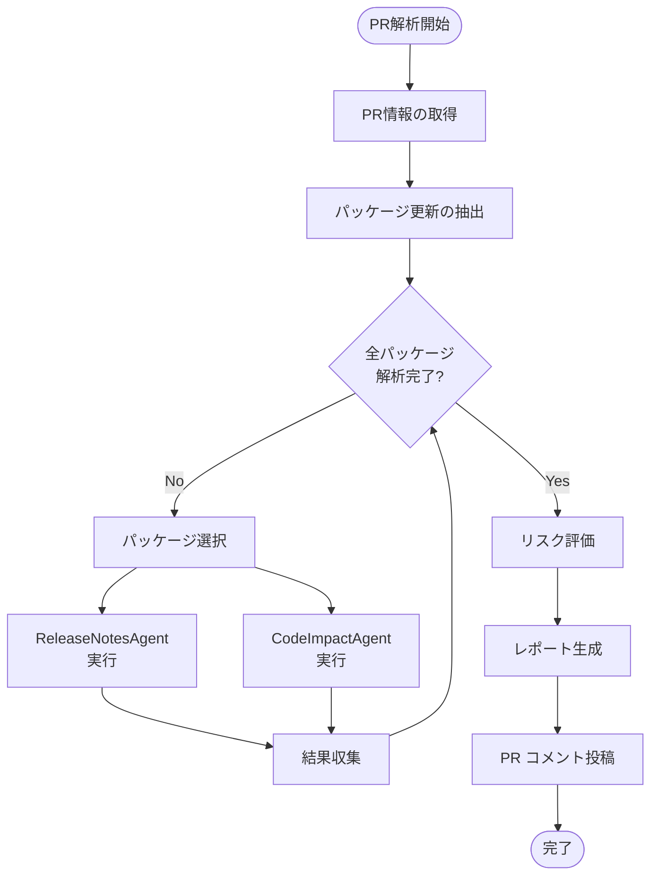

## Agent 構成

### 1. ReleaseNotesAgent

リリースノートと変更履歴を収集・分析するAgent

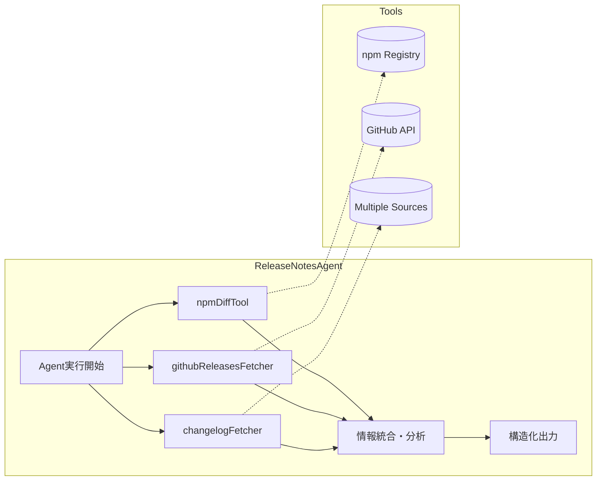

**利用ツール:**
- `npmDiffTool`: npm registryから差分情報を取得
- `githubReleasesFetcher`: GitHub Releasesから情報を取得
- `changelogFetcher`: 複数ソースからchangelog情報を取得

### 2. CodeImpactAgent

コード変更の影響を分析するAgent

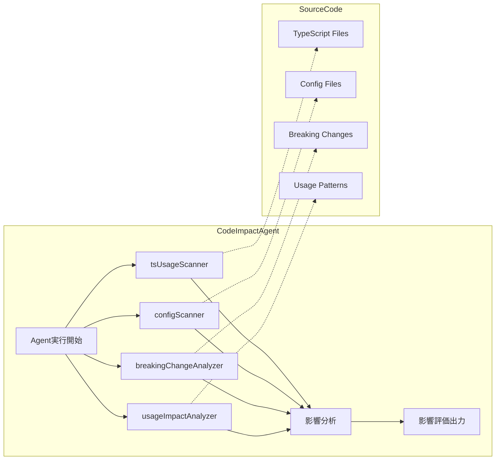

**利用ツール:**
- `tsUsageScanner`: TypeScriptコードの使用箇所をスキャン
- `configScanner`: 設定ファイルでの使用を検出
- `breakingChangeAnalyzer`: 破壊的変更を分析
- `usageImpactAnalyzer`: 実際の使用パターンへの影響を評価

## Tool レイヤー

### 主要ツール一覧

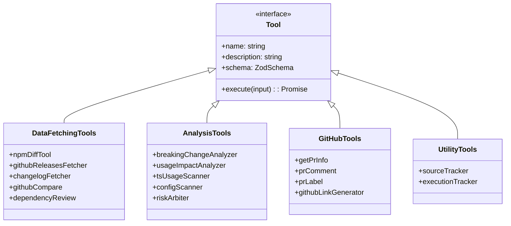

### ツールの実行フロー

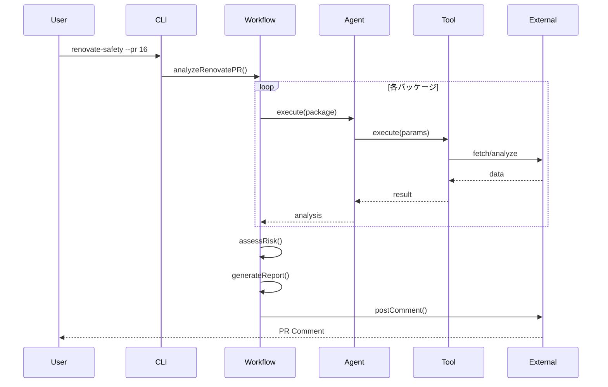

## データフロー

### 1. 情報収集フェーズ

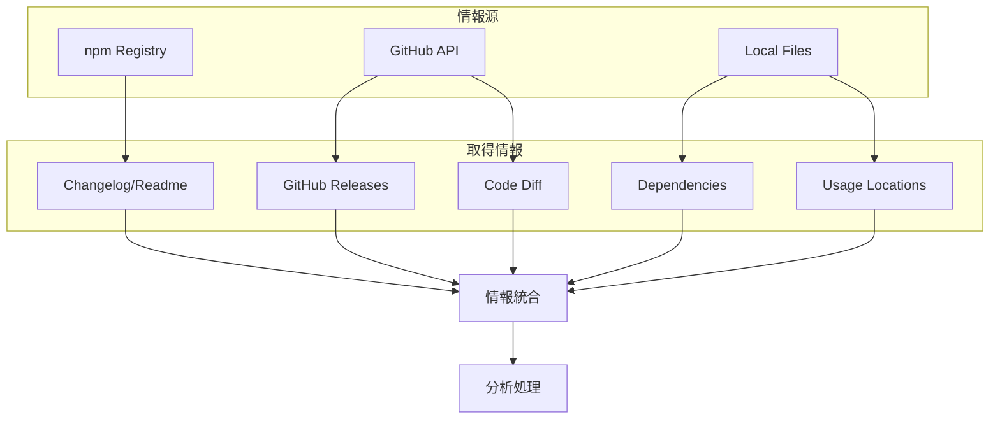

### 2. 分析フェーズ

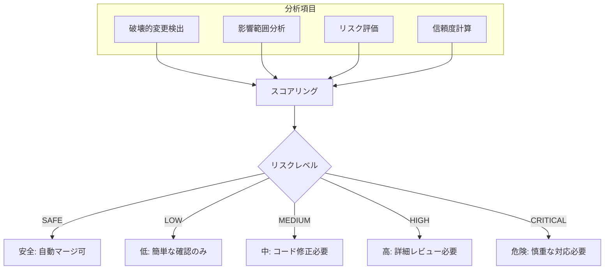

## 破壊的変更の検出パターン

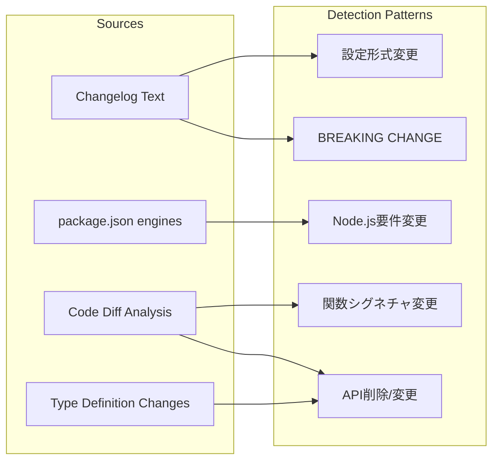

## 実行トラッキング

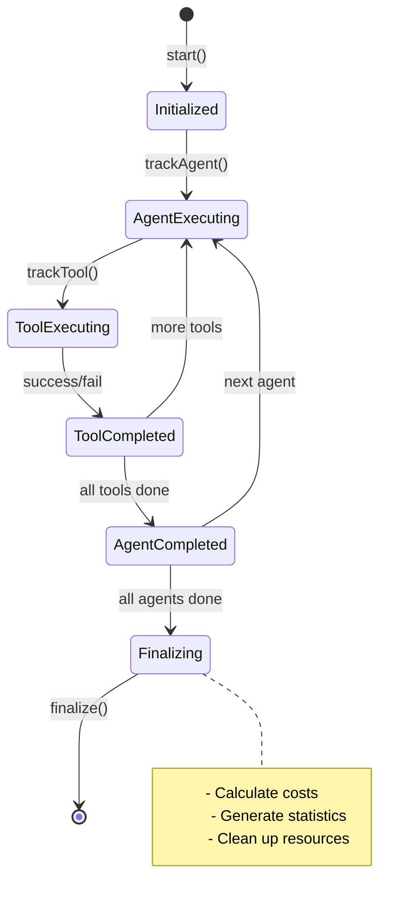

## エラーハンドリング

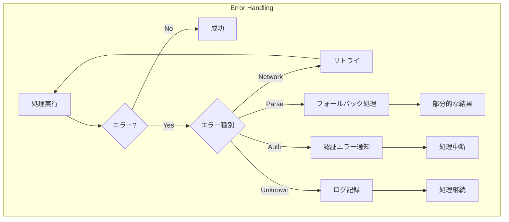

## 設定とカスタマイズ

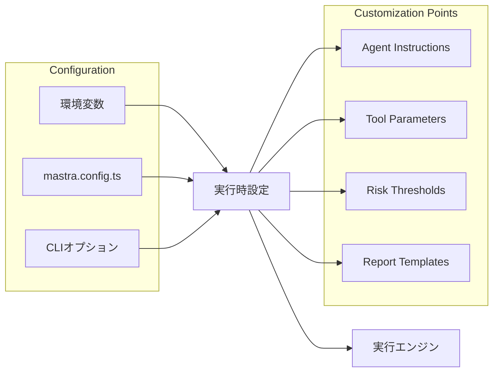

## パフォーマンス最適化

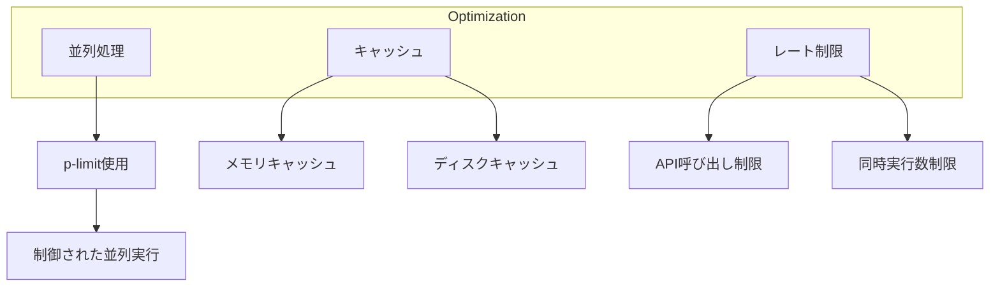

## まとめ

renovate-safetyのAgent/Toolアーキテクチャは、以下の特徴を持ちます：

1. **モジュラー設計**: 各AgentとToolが独立して動作し、必要に応じて組み合わせ可能
2. **並列処理**: p-limitを使用した効率的な並列実行
3. **フォールバック**: 複数の情報源から取得し、1つが失敗しても継続
4. **詳細な追跡**: ExecutionTrackerによる実行状況の記録
5. **柔軟な拡張**: 新しいAgent/Toolの追加が容易

このアーキテクチャにより、高速で信頼性の高いパッケージ更新の安全性評価を実現しています。